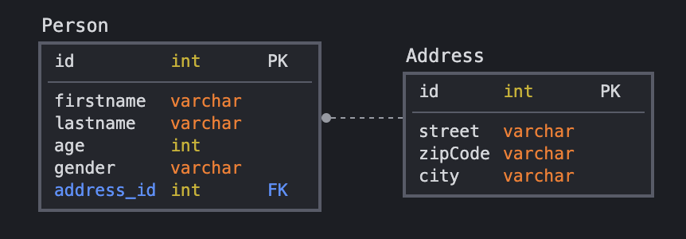

# GraphQL or gRPC in Java

This article presents GraphQL and gRPC implemented with Java.

With the same use case, I'm going to show you how to expose and to implement these protocols.

I use a simple use case but not just a one table use case...Ok, just a 2 tables with a relation one-to-one.

To make this article, I use [Helidon](https://helidon.io/).

_Why Helidon?_ **Why not!** ...seriously, because this framework offers the possibility to implement these protocols ( _and of course, for me, to discover this framework ;-)_ )

## Table of contents

- [About Helidon](#about-helidon)
- [Use case](#use-case)
  - [Definition](#definition)
  - [Helidon DB Client](#helidon-db-client)
- [Init Project](#init-project)
- [GraphQL](#graphql)
  - [Schema](#schema)
  - [Maven](#maven)
  - [Implementation](#implementation)
- [gRPC](#grpc)
  - [Protocol buffers](#protocol-buffers)
  - [Maven](#maven)
  - [Implementation](#implementation)
- [Conclusion](#conclusion)

## About Helidon

[Helidon](https://helidon.io/) is a java framework with 2 versions : 

- Helidon SE : A Reactive Microframework.
    - Tiny Footprint
    - Functional Style  
    - Simple and Transparent
    - GraalVM Native Image
    - [More information here](https://helidon.io/docs/latest/#/about/02_introduction)
- Helidon MP : A MicroProfile implementation.
    - Support MP 3.3
    - Small Footprint 
    - Declarative Style
    - Dependency Injection 
    - CDI, JAX-RS, JSON-P/B
    - [More information here](https://helidon.io/docs/latest/#/mp/guides/02_quickstart)

In these 2 versions, Helidon offers a lot of facilities around GraphQL or gRPC implementations (that's a good reason to use it for this article)

There is a lot of other possibilities like reactive streams, reactive messaging or predefined health-check or metrics...

And gives facility to build it with docker or GraalVM and to deploy it with Kubernetes.

_So, try it for fun and why not for your project ;-)_

## Use case

### Definition

Just a simple use case : A person with an address => Address is in a separate table for this article.

So we have : 



### Helidon DB Client

For the database and my use case, I used an H2 in-memory Database and [Helidon DB-Client](https://helidon.io/docs/latest/#/se/dbclient/01_introduction).

Helidon DB Client is a reactive API for access database. You can access with JDBC Driver (H2, Oracle, MySQL...) or directly with MongoDB.

For this article, I used a JDBC. So I added these dependencies : 

```xml
     <dependency>
         <groupId>io.helidon.dbclient</groupId> 
         <artifactId>helidon-dbclient</artifactId>
     </dependency>
     <dependency>
         <groupId>io.helidon.dbclient</groupId> 
         <artifactId>helidon-dbclient-jdbc</artifactId>
     </dependency>
```
All the database implementation is [here in this maven module](/db-helidon)

It contains 2 important files in [resources](/db-helidon/src/main/resources/) : 
- [db.yaml](/db-helidon/src/main/resources/db.yaml) : contains configuration for h2 Database
- [statements.yaml](/db-helidon/src/main/resources/statements.yaml) : contains all statements like tables creation or sequences...

## Init Project

Use archetype from [documentation](https://helidon.io/docs/latest/#/se/guides/02_quickstart)

```shell
mvn -U archetype:generate -DinteractiveMode=false \
    -DarchetypeGroupId=io.helidon.archetypes \
    -DarchetypeArtifactId=helidon-quickstart-se \
    -DarchetypeVersion=2.2.1 \
    -DgroupId=fr.jufab \
    -DartifactId=graphql-helidon \
    -Dpackage=fr.jufab.graphql
```

and 

```shell
mvn -U archetype:generate -DinteractiveMode=false \
    -DarchetypeGroupId=io.helidon.archetypes \
    -DarchetypeArtifactId=helidon-quickstart-se \
    -DarchetypeVersion=2.2.1 \
    -DgroupId=fr.jufab \
    -DartifactId=grpc-helidon \
    -Dpackage=fr.jufab.grpc
```

_I transformed projects into 3 maven modules and deleted all the GraalVM or Docker builder for reused database in graphQL or gRPC module._

Or, you can use helidon cli to manage your project.
https://helidon.io/docs/latest/#/about/05_cli


## GraphQL

So now, let's talk about GraphQL.

GraphQL is a query language and operates on a single endpoint. it talks with JSON language. It defines with a schema, describes valid attributes, operations, etc...
And GraphQL is a [specification](https://spec.graphql.org/)

### Schema

To define GraphQL, we need to use a schema with this information : 
- Object : composition of an object response
- Query : query to request objects or array's object.
- Mutation : to save/modify objects.
- Subscription : to establish a bi-directional communication channel using WebSocket

With the use case, the schema, [available here](graphql-helidon/src/main/resources/person.graphqls), is : 

```graphql
# Objects
type Person {
    id: ID!
    firstname: String!
    lastname: String!
    age: Int
    gender: Gender!
    address: Address
}

enum Gender {
    WOMAN,
    MAN
}

type Address {
    id: ID!
    street: String!
    zipCode: String!
    city: String!
}
# Query
type Query {
    personById(id: ID!): Person
    personsByFirstName(firstname: String!): [Person]
    persons:[Person]
}
# Mutation
type Mutation {
    createPersonWithAddress(firstname: String!, lastname: String!, age: Int, gender: Gender, street: String!, zipCode: String!, city: String!):Person
    createPerson(firstname: String!, lastname: String!, age: Int, gender: Gender, idAddress: ID!):Person
    createAddress(street: String!, zipCode: String!, city: String!): Address
}
```

### Maven

In helidon SE, there is a facility to use GraphQL with a helidon GraphQL library.

[_More information about this integration in the documentation_](https://helidon.io/docs/latest/#/se/graphql/01_introduction)

**For the moment, this feature is experimental...but it works for this project :)**

To insert GraphQL in the project, I added the dependency in the [pom.xml](graphql-helidon/pom.xml) file

```xml
<dependency>
  <groupId>io.helidon.graphql</groupId>
  <artifactId>helidon-graphql-server</artifactId>
</dependency>
```

This dependency uses [GraphQL java version 15.0](https://www.graphql-java.com/).

### Implementation

#### Server

GraphQL must be registered to the webserver. 

In the [Main class](graphql-helidon/src/main/java/fr/jufab/graphql/Main.java), it was registered here : 

```java
WebServer server = WebServer.builder()
        .routing(Routing.builder()
            .register(health)                   // Health at "/health"
            .register(MetricsSupport.create())  // Metrics at "/metrics"
            .register(GraphQlSupport.create(buildSchema(dbClient)))
            .build())
        .config(config.get("server"))
        .build();
```

Exactly the line : 

```java
register(GraphQlSupport.create(buildSchema(dbClient)))
```

The GraphQlSupport class takes a GraphQLSchema. Method buildSchema() creates a configured GraphQLSchema.

```java
private static GraphQLSchema buildSchema(DbClient dbClient) {
    SchemaParser schemaParser = new SchemaParser();
    Resource schemaResource = Resource.create(PERSON_GRAPHQLS);
    TypeDefinitionRegistry typeDefinitionRegistry =
        schemaParser.parse(schemaResource.string(StandardCharsets.UTF_8));
    SchemaGenerator schemaGenerator = new SchemaGenerator();
    return schemaGenerator.makeExecutableSchema(typeDefinitionRegistry,
        buildRuntimeWiring(dbClient));
  }
```
it requires:

* schema : person.graphqls
* parser : to instantiate a typeDefinitionRegistry
* RuntimeWiring : to connect data with datafetcher

Method buildRuntimeWiring connects Object (Person, Address) with datafetcher.

```java
private static RuntimeWiring buildRuntimeWiring(DbClient dbClient) {
  AddressRepository addressRepository = new AddressRepository(dbClient);
  AddressDataFetcher addressDataFetcher = new AddressDataFetcher(addressRepository);
  PersonRepository personRepository = new PersonRepository(dbClient);
  PersonDataFetcher personDataFetcher = new PersonDataFetcher(personRepository);
  return RuntimeWiring.newRuntimeWiring()
    .type(TypeRuntimeWiring.newTypeWiring("Query")
      .dataFetcher("persons", personDataFetcher.getPersons()))
    .type(TypeRuntimeWiring.newTypeWiring("Query")
      .dataFetcher("personById", personDataFetcher.getPersonById()))
    .type(TypeRuntimeWiring.newTypeWiring("Query")
     .dataFetcher("personsByFirstName", personDataFetcher.getPersonsByFirstName()))
    .type(TypeRuntimeWiring.newTypeWiring("Person")
     .dataFetcher("address", addressDataFetcher.getAddressById()))
    .type(TypeRuntimeWiring.newTypeWiring("Mutation")
     .dataFetcher("createPersonWithAddress", personDataFetcher.createPersonWithAddress()))
    .type(TypeRuntimeWiring.newTypeWiring("Mutation").dataFetcher("createAddress",
      addressDataFetcher.createAddress()))
    .build();
}
```

There are all Query or Mutation in this method and all of them are link with a DataFetcher

#### DataFetcher

All Objects will be associated to a _DataFetcher_ object. DataFetcher has the responsibility to load objects for Query or to save objects for Mutation.

How it works : 

You define a _DataFetcher_ with a _DataFetchingEnvironment_ object. This object contains all arguments or fields to be fetched.

like this ([PersonDataFetcher](/graphql-helidon/src/main/java/fr/jufab/graphql/datafetcher/PersonDataFetcher.java)): 

```java
// To get all Persons... no arguments
public DataFetcher<List<Person>> getPersons() {
    return environment -> personRepository.getPersons().collectList().get();
}
//To get all by FirstName
public DataFetcher<List<Person>> getPersonsByFirstName() {
    return environment -> personRepository.getPersonsByFirstName(environment.getArgument("firstname")).collectList().get();
}
// Or to create a person
public DataFetcher<Person> createPersonWithAddress() {
    return environment -> this.personRepository.createPerson(
        new Person(environment.getArgument("firstname"), environment.getArgument("lastname"),
          environment.getArgument("age"),
          new Address(environment.getArgument("street"), environment.getArgument("zipCode"),
            environment.getArgument("city")),
          Gender.valueOf(environment.getArgument("gender")))).get();
}
```

_More information about DataFetching => https://www.graphql-java.com/documentation/v16/data-fetching/_

And that's it for GraphQL...

## gRPC

gRPC helps you to build web services. It's cross-language but this project is a Java project so... :)

To define and describe service, gRPC uses a simple definition file and uses protocol buffers format.

_For more informations : https://grpc.io/_

### Protocol buffers

gRPC uses protocol buffers : https://developers.google.com/protocol-buffers

Protocol buffers is a language for serializing structured data.

You can define some options for every language:  "package" for java or "objc_class_prefix" for Objective-C to prefix generated classes.

For this lab, I used the syntax version "proto3"

Protobuf file contains : 

- message : Object Data
- enum : define enumeration
- service : Service to query, modify or save data


With the use cases, proto file [available here](grpc-helidon/src/main/proto/person.proto) has this definition

```protobuf
syntax = "proto3";
option java_package = "fr.jufab.grpc.proto";
option java_multiple_files = true;
option java_generic_services = true;
option java_outer_classname = "Helidon";

enum Gender {
  WOMAN = 0;
  MAN = 1;
}

message Person {
  int32 id = 1;
  string firstname = 2;
  string lastname = 3;
  int32 age = 4;
  Gender gender = 5;
  Address address = 6;
}

message Address {
  int32 id = 1;
  string street = 2;
  string zipCode = 3;
  string city = 4;
}

message Persons {
  repeated Person persons=1;
}

message QueryPerson {
  int32 id=1;
  string firstname=2;
}

message PersonWithAddressToSave {
  string firstname = 1;
  string lastname = 2;
  int32 age = 3;
  Gender gender = 4;
  string street = 5;
  string zipCode = 6;
  string city = 7;
}

message PersonToSave{
  string firstname = 1;
  string lastname = 2;
  int32 age = 3;
  Gender gender = 4;
  int32 idAddress = 5;
}

message AddressToSave{
  string street = 1;
  string zipCode = 2;
  string city = 3;
}

message QueryAddress {
  int32 id = 1;
}

service PersonService {
  rpc persons(QueryPerson) returns (Persons);
  rpc personById(QueryPerson) returns (Person);
  rpc personsByFirstName(QueryPerson) returns (Persons);

  rpc createPersonWithAddress(PersonWithAddressToSave) returns (Person);
  rpc createPerson(PersonToSave) returns (Person);
}

service AddressService {
  rpc createAddress(AddressToSave) returns (Address);
  rpc addressById(QueryAddress) returns (Address);
}

```

### Maven

Helidon SE offers a maven dependency to deploy gRPC server.

[_More information about this integration in the documentation_](https://helidon.io/docs/latest/#/se/grpc/01_introduction)

**Like GraphQL, gRPC feature is experimental for the moment...but it works for this project :)**

To insert gRPC in the project, I added the dependency in the [pom.xml](grpc-helidon/pom.xml)

```xml
<dependency>
    <groupId>io.helidon.grpc</groupId>
    <artifactId>helidon-grpc-server</artifactId>
</dependency>
```

But to use gRPC and specially protobuf, that's not enough...

You must generate data from protobuf file with a special maven plugin. This plugin use Protocol Buffer Compiler.

In this project, to generate classes, there is this maven definition in [pom.xml](grpc-helidon/pom.xml).

```xml
<plugin>
    <groupId>org.xolstice.maven.plugins</groupId>
    <artifactId>protobuf-maven-plugin</artifactId>
    <version>0.6.1</version>
    <configuration>
        <protocArtifact>com.google.protobuf:protoc:3.3.0:exe:${os.detected.classifier}</protocArtifact>
        <pluginId>grpc-java</pluginId>
        <pluginArtifact>io.grpc:protoc-gen-grpc-java:1.4.0:exe:${os.detected.classifier}</pluginArtifact>
    </configuration>
    <executions>
        <execution>
            <goals>
                <goal>compile</goal>
                <goal>compile-custom</goal>
            </goals>
        </execution>
    </executions>
</plugin>
```
_more info about this plugin here https://www.xolstice.org/protobuf-maven-plugin/_

All classes are generated in "generated-sources".

### Implementation
#### Server

To start gRPC server, Helidon offers a specific server on this purpose.

You need to start a GrpcServer like this

```java
GrpcServer grpcServer = GrpcServer
        .create(GrpcServerConfiguration.create(config.get("grpcserver")),GrpcRouting.builder()
            .register(buildPersonServiceGrpc(dbClient)) //See after for this
            .register(buildAddressServiceGrpc(dbClient)) //See after for this
            .build())
        .start()
        .toCompletableFuture()
        .get(10, TimeUnit.SECONDS);
```

By default, port is on 1408 but you can redefine it in your yaml like this : 

```yaml
grpcserver:
  port: 3333
```

_[You can see example here](grpc-helidon/src/main/resources/server.yaml)_

#### Service

You can see in server, the service registered "PersonServiceGrpc" or "AddressServiceGrpc".

These 2 services available [here](grpc-helidon/src/main/java/fr/jufab/grpc/service/PersonGrpcService.java) and [here](grpc-helidon/src/main/java/fr/jufab/grpc/service/AddressGrpcService.java)

These services implement service supplied by Protobuf generated classes. So, in "PersonGrpcService", this class implements "PersonServiceGrpc.PersonServiceImplBase".

By default, you can't see this class "PersonServiceGrpc" because you need to generate class with the protobuf file. Why my package is in "fr.jufab.grpc.proto"? Because I used an option in protobuf :

```protobuf
option java_package = "fr.jufab.grpc.proto";
```

For example, PersonServiceGrpc gives me all methods define in protobuf. 

Remember service in protbuf : 

```protobuf
service PersonService {
  rpc persons(QueryPerson) returns (Persons);
  rpc personById(QueryPerson) returns (Person);
  rpc personsByFirstName(QueryPerson) returns (Persons);

  rpc createPersonWithAddress(PersonWithAddressToSave) returns (Person);
  rpc createPerson(PersonToSave) returns (Person);
}
```

and PersonServiceGrpc gives you : 

```java
public static abstract class PersonServiceImplBase implements io.grpc.BindableService {

  /**
   */
  public void persons(fr.jufab.grpc.proto.QueryPerson request,
          io.grpc.stub.StreamObserver<fr.jufab.grpc.proto.Persons> responseObserver) {
    asyncUnimplementedUnaryCall(METHOD_PERSONS, responseObserver);
  }

  /**
   */
  public void personById(fr.jufab.grpc.proto.QueryPerson request,
          io.grpc.stub.StreamObserver<fr.jufab.grpc.proto.Person> responseObserver) {
    asyncUnimplementedUnaryCall(METHOD_PERSON_BY_ID, responseObserver);
  }

  /**
   */
  public void personsByFirstName(fr.jufab.grpc.proto.QueryPerson request,
          io.grpc.stub.StreamObserver<fr.jufab.grpc.proto.Persons> responseObserver) {
    asyncUnimplementedUnaryCall(METHOD_PERSONS_BY_FIRST_NAME, responseObserver);
  }

  /**
   */
  public void createPersonWithAddress(fr.jufab.grpc.proto.PersonWithAddressToSave request,
          io.grpc.stub.StreamObserver<fr.jufab.grpc.proto.Person> responseObserver) {
    asyncUnimplementedUnaryCall(METHOD_CREATE_PERSON_WITH_ADDRESS, responseObserver);
  }

  /**
   */
  public void createPerson(fr.jufab.grpc.proto.PersonToSave request,
          io.grpc.stub.StreamObserver<fr.jufab.grpc.proto.Person> responseObserver) {
    asyncUnimplementedUnaryCall(METHOD_CREATE_PERSON, responseObserver);
  }
}
```

Now, just implements these methods with your repository or DB access.

For method "persons" in [PersonGrpcService](grpc-helidon/src/main/java/fr/jufab/grpc/service/PersonGrpcService.java), I implemented it like that : 

```java
@Override public void persons(QueryPerson request,
      StreamObserver<fr.jufab.grpc.proto.Persons> responseObserver) {
    try {
      complete(responseObserver, buildPersonsGrpc(personRepository.getPersons()
          .collectList()
          .get()));
    } catch (InterruptedException e) {
      LOGGER.log(Level.SEVERE, "Error", e);
    } catch (ExecutionException e) {
      LOGGER.log(Level.SEVERE, "Error", e);
    }
  }
```
You can see all implementation in [PersonGrpcService](grpc-helidon/src/main/java/fr/jufab/grpc/service/PersonGrpcService.java) and [AddressGrpcService](grpc-helidon/src/main/java/fr/jufab/grpc/service/AddressGrpcService.java)

That's it for gRPC.

## Conclusion

GraphQL and gRPC offer a same approach : to use a schema and to generate resources from description. 

GraphQL is an HTTP protocol with schema definition. So you can access to this resource with any language who accepts HTTP request.

gRPC communicates over his protocol (HTTP/2) and you need to generate your service from the protobuf.

In my opinion : 

- GraphQL may be better for external exposition like for mobile, open API, surely other case.
- gRPC may be better for internal communication like in cloud, with defined client, in K8s Cluster, in information system...

Of course, it can depend on your use. Maybe this article can help you to choose.
